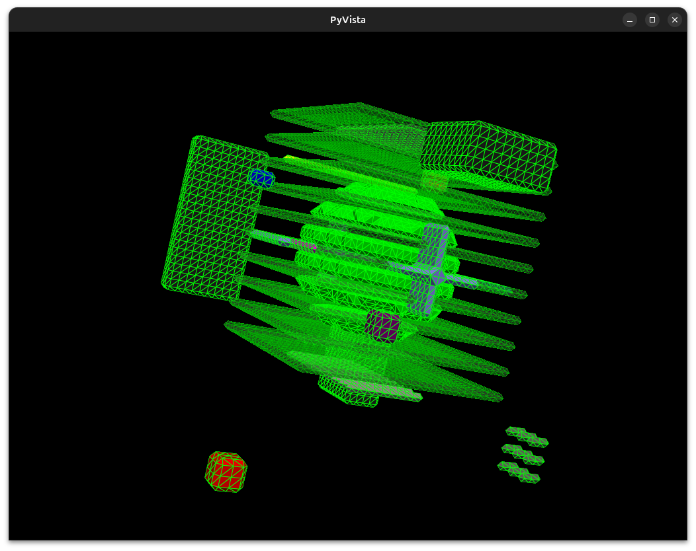

# extra

This folder is a testbed for procedural modeling powered by [VoxelMap](https://github.com/moxilang/voxelmap) and GPT-assisted code synthesis.

These experiments explore the generation of complex voxel structures via conversational input, scripted automation, and mesh rendering.  
All conversation management is powered by [`fur`](https://github.com/fur-labs/fur-cli) — a custom framework for contextual dialogue persistence and versioning.

---

## 🧠 Metadata

* **GPT:** VoxelMapGPT v5.1 (custom GPT trained on VoxelMap codices)
* **Conversation record**: [LOW_POLY_SPACE.md](LOW_POLY_SPACE.md)
* **Conversation Manager:** [fur](https://github.com/fur-labs/fur-cli)
* **Voxel Engine:** [VoxelMap](https://github.com/moxilang/voxelmap)
* **Testbed Repo:** [voxelmap-gpt-tests](https://github.com/moxilang/voxelmap-gpt-tests)

---

## 🌌 Sample Preview

